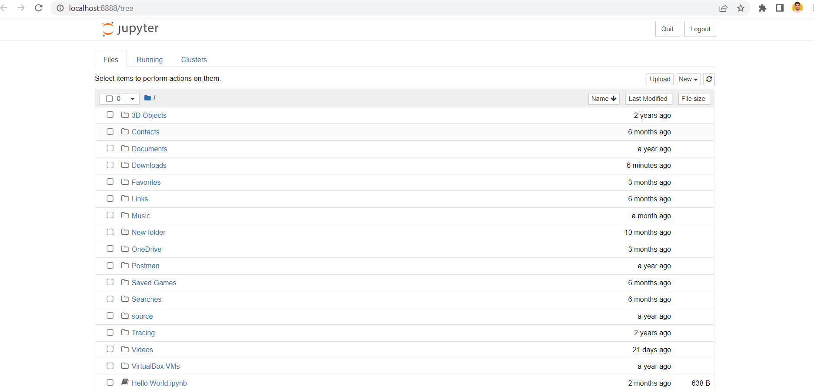
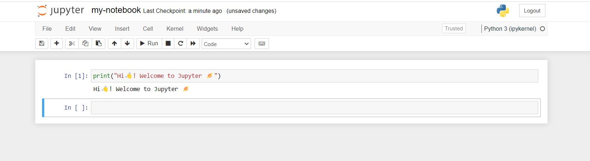

Certainly! Below is the guide to using Jupyter Notebook in Markdown format:

# A Comprehensive Guide to Using Jupyter Notebook


## What is Jupyter Notebook?

Jupyter Notebook is an open-source web application that allows you to create and share documents containing live code, equations, visualizations, and narrative text. It's widely used in data science and scientific computing due to its interactive and flexible nature. Let's go through the steps to install and use Jupyter Notebook:

## Installation

1. **Python Installation**: Jupyter Notebook requires Python, so if you don't have Python installed, start by downloading and installing the latest version of Python from the official website: [Python Downloads](https://www.python.org/downloads/)

2. **Install Jupyter using pip**: Once you have Python installed, open a command prompt (Windows) or terminal (macOS/Linux) and type the following command to install Jupyter Notebook using pip:

```bash
pip install jupyter
```

3. **Install Jupyter using conda (Anaconda/Miniconda)**: If you are using Anaconda or Miniconda, you can install Jupyter Notebook using conda. Open the Anaconda prompt (Windows) or terminal (macOS/Linux) and type:

```bash
conda install -c conda-forge jupyter
```

## Launching Jupyter Notebook



1. **Starting the Jupyter Server**: After installation, you can start the Jupyter server by opening a command prompt (Windows) or terminal (macOS/Linux) and typing:

```bash
jupyter notebook
```

2. **Jupyter Dashboard**: After running the above command, your default web browser will open, and you will see the Jupyter Dashboard. It displays the files and directories in the current working directory. From here, you can navigate through your files and create new notebooks.

## Using Jupyter Notebook

1. **Create a new notebook**: In the Jupyter Dashboard, click on the "New" button on the top right corner and choose "Python 3" (or any other available kernel) to create a new Python 3 notebook. A new tab will open with an empty notebook.

2. **Notebook Interface**: The Jupyter Notebook interface consists of a menu bar, toolbar, code cells, markdown cells, and output cells. You can add, edit, and execute cells in the notebook.



3. **Cell Types**:

   - Code Cells: Used for writing and executing code.
   - Markdown Cells: Used for adding text, headings, images, and formatting using Markdown syntax.
   - Raw Cells: Used for entering raw text or content that won't be executed.

4. **Executing Code**: To execute a code cell, click on it to select it and then either press "Shift + Enter" or click the "Run" button in the toolbar. The output (if any) will be displayed below the cell.

5. **Adding and Deleting Cells**: You can add new cells using the "+" button in the toolbar. To delete a cell, select it and press "Esc" followed by "D" twice (pressing "D" twice deletes the cell).

6. **Changing Cell Types**: You can change the cell type from the dropdown menu in the toolbar. Select a cell and choose "Code," "Markdown," or "Raw" as needed.

7. **Saving Notebooks**: To save your work, press "Ctrl + S" or use the "Save and Checkpoint" option in the "File" menu.

8. **Renaming Notebooks**: By default, a new notebook is named "Untitled.ipynb". To rename it, click on the current name at the top of the page.

9. **Closing Notebooks**: To close a notebook, go to the Jupyter Dashboard and click on the "Shutdown" button next to the corresponding notebook.

10. **Stopping the Jupyter Server**: To stop the Jupyter server, go to the command prompt (where the server is running) and press "Ctrl + C" to shut it down.

## Additional Tips

1. **Keyboard Shortcuts**: Jupyter Notebook has several useful keyboard shortcuts for faster navigation and execution. You can access them by clicking "Help" > "Keyboard Shortcuts" in the Jupyter Notebook menu.

2. **Markdown Basics**: If you are not familiar with Markdown syntax, you can find a Markdown cheat sheet online to help you format text in Markdown cells.

3. **Saving and Exporting**: In addition to saving notebooks in .ipynb format, you can export them to other formats like PDF, HTML, or Python script (.py) using the "File" > "Download As" option.

That's a comprehensive guide to installing and using Jupyter Notebook. It's a powerful tool for interactive coding, data analysis, and visualization. Happy coding!
